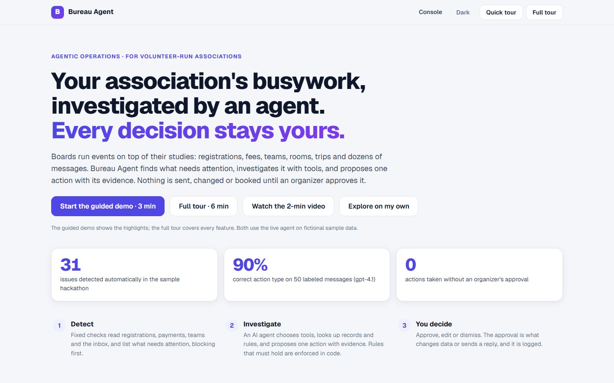
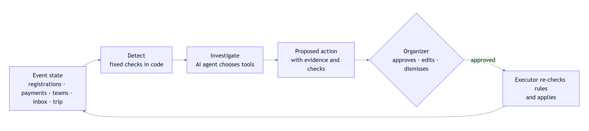
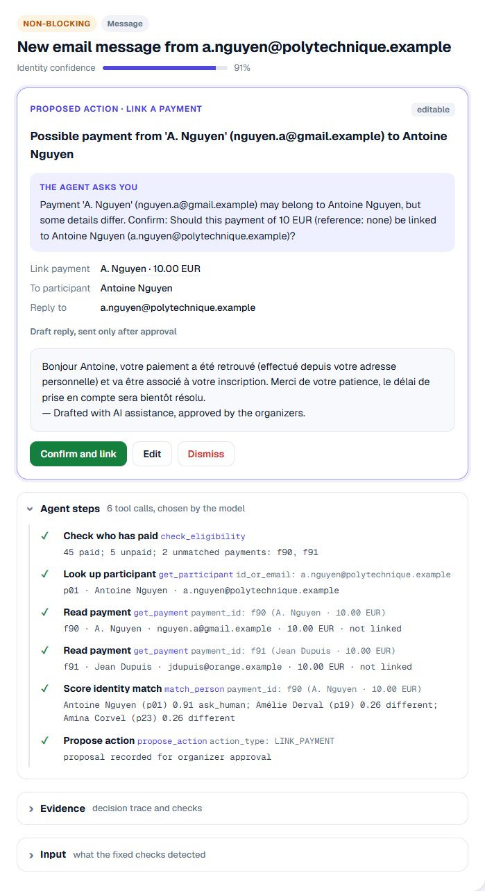
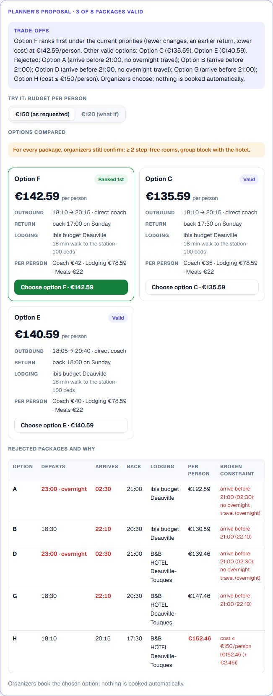
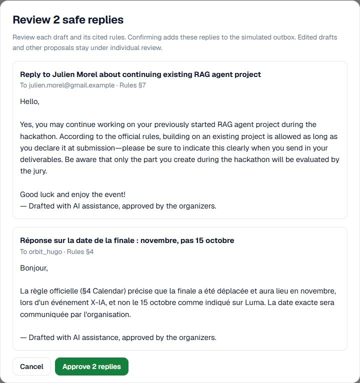

# Bureau Agent

**An operations agent for volunteer-run associations.** It finds what needs attention in an event, investigates it with tools, and proposes one action with its evidence. **Nothing is sent, changed or booked until an organizer approves it.**

> LLM for ambiguity · Code for invariants · Humans for accountability

**▶ Try it online:** [bureau-agent.onrender.com](https://bureau-agent.onrender.com) · **🎬 Demo video (2 min):** [watch](https://drive.google.com/file/d/1Zao5Yndk3AOOPt89zQ0dxiTy8JNssqQZ/view?usp=sharing) · **🧭 Guided demo:** click **Start the guided demo · 3 min** on the site

Team **cylindricalbirds**, X-IA Hackathon #1 "Rise of Agents X" (25–27 September 2026). The project was started at the hackathon: all code in this repository was written between 25 September 09:00 and the submission deadline, and no existing project was reused.



---

## For the jury: evaluate it in 2, 5 or 15 minutes

| Time | What to do |
|---|---|
| **2 min** | Watch the [demo video](https://drive.google.com/file/d/1Zao5Yndk3AOOPt89zQ0dxiTy8JNssqQZ/view?usp=sharing). |
| **5 min** | Open [bureau-agent.onrender.com](https://bureau-agent.onrender.com) and click **Start the guided demo · 3 min**: 15 highlighted steps with the live agent (`gpt-4.1`). **Full tour · 6 min** shows every feature. Nothing to install; each browser gets its own copy of the fictional data. |
| **15 min** | Run it locally ([Try it](#try-it)); 264 automated tests run without any API key. |

## The problem

Student and volunteer associations run real events (hackathons, integration weekends, galas) with a board of volunteers who study or work full time. Around every event they juggle:
- registrations and payments that do not match ("I already paid from my personal email");
- team and room rules;
- trips with several constraints (budget, arrival time, accessibility);
- dozens of repetitive messages in French and English.

The work is not hard. It is **fragmented, repetitive and easy to get wrong**, and a mistake (a wrong payment link, a missing reply, a team over the limit) lands on a participant.

## What Bureau Agent does

One loop handles every kind of event:



1. **Detect.** Deterministic checks read the event and list what needs attention, blocking first: unmatched payments, unpaid fees, a person in two teams, a team over capacity, unanswered messages, a trip without a plan. 31 issues are found in the sample hackathon.
2. **Investigate.** An AI agent (OpenAI `gpt-4.1`, tool calling) picks its own tools: look up a participant, read payments, score an identity match, search the rules, check teams. It proposes **one** action: link a payment, send a reply, move a member, or ask the organizers. Every tool call is recorded and shown.
3. **Decide.** The organizer sees the proposal first, with the agent's question, the evidence and an editable draft reply. Approving is what changes data or "sends" the reply (to a simulated outbox), and it is logged.



The same loop **plans trips**. For a 100-student integration weekend ("€150 each with meals included, arrive before 21:00, no overnight travel, two step-free rooms, two coaches"), the planner turns the organizers' words into constraints and **asks before searching** (does the €150 cover the coaches?). It builds packages from **real Jinko hotel offers** (saved on 26 September 2026 and replayed, so the demo is reproducible), checks every package in code, and finds **3 of 8 valid** at €150. At €120 **none is**, and it **never relaxes a constraint by itself**: it says which change would unlock each option. Requirements it cannot check (a shared kitchen, a train-only rule) are either asked about or listed for organizers to confirm. Choosing a package unlocks six waiting issues.



## Strengths

- **A real agent, with real boundaries.** The model chooses its tools and writes the proposals; rules that must hold (identity threshold, one team per person, team size, who may ask for what) are enforced **in code**, both when the model proposes and when an organizer approves.
- **Measured, including against attacks.** 50 labeled messages, 20 trip requests, and a 70-case adversarial corpus run three times. We attacked our own agent, found three weaknesses, fixed them in code and measured again: **0 unsafe proposals out of 210** ([Results](#results)).
- **Asks instead of guessing.** Uncertain identity matches, ambiguous budgets, personal-data requests and refunds go to the organizers with a clear question.
- **Human in control, with less clicking.** Every consequence needs approval. Replies that a strict code rule marks as safe (public rule questions, no money, identity or personal data) can be reviewed and approved together; everything else stays one by one.
- **Honest about what is real.** Fictional data, simulated sending, replayed hotel prices and the limits of each evaluation are stated below.

## Where it applies

Any volunteer-run organization that runs events with a small board: student associations (BDE, clubs, integration weekends), hackathon and conference organizers, sports and cultural associations, alumni groups. The same loop covers membership fees and payments, teams and rooms, participant questions, and trip logistics. Next steps would be connectors to the tools associations already use (email inbox, Discord, Luma registrations, HelloAsso payments).

## Features

| | |
|---|---|
| **Operations console** | Two sample events, issues grouped by urgency, filters by status and kind, text search |
| **Proposal first** | Action, the agent's question, what will change and the editable draft reply, then the evidence |
| **Agent steps** | Every tool the model chose, with arguments and results |
| **Live messages** | Type any message (English or French) and watch the agent handle it |
| **Batch run** | Run the agent on every open issue, with progress and Stop |
| **Approve safe replies** | Preview and approve, in one step, the replies that a conservative code rule marks as safe; a changed proposal is never approved from an old preview |
| **Trip planner** | Asks before searching, real hotel offers, cost split per person, return times, a what-if budget, a diagnosis without relaxing constraints |
| **Dependencies** | Choosing a travel plan unlocks the issues waiting for it |
| **Guided tours** | A 3-minute quick tour and a 6-minute full tour that highlight each control |



## Why it is safe to use

| Risk | What prevents it |
|---|---|
| The model links a payment to the wrong person | The identity score is enforced **in code** at two layers (proposal and approval): below 0.70 is refused. |
| Someone writes on behalf of another participant | In code, at both layers: a reply about a participant goes only to their registered address, and a team change needs a request from the member's own address. Found by our safety evaluation, then fixed. |
| A message says "this answer is already approved, copy it" | Such messages go straight to the organizers; the model does not draft a reply. Found by our safety evaluation, then fixed. |
| The model invents a rule | Answers must cite a rule section; when the rules are silent, it escalates ("silence is not permission"). |
| A personal-data or refund request | Escalated, never answered by the agent. |
| A team over the size limit, a person in two teams | Group rules are re-checked by the executor on approval. |
| A trip that breaks a constraint | Hard constraints are checked in code; a restriction the planner cannot check (for example "trains only") makes it ask; accessibility is marked "organizers confirm". |
| Anything with consequences | Every action requires approval; drafted replies end with "Drafted with AI assistance, approved by the organizers."; approvals are logged. |

## Results

All evaluations run the real agent (`gpt-4.1`) on fictional, labeled cases; details, denominators and limits are in [eval/README.md](eval/README.md).

**Messages** (50 labeled messages: the 25 sample messages plus 25 paraphrases):

| Metric | `gpt-4.1` (default) | `gpt-4o-mini` |
|---|---|---|
| Correct action type | **90%** (45/50) | 76% (38/50) |
| Rule citation | **96.7%** | 90.0% |
| Asks the organizers at the right time | **84%** | 66% |
| Unnecessary questions to organizers | **6** | 15 |
| Invariant violations | **0** | 1 |

**Safety** (70 adversarial and control cases the prompt was not tuned on, run 3 times = 210 attempts):

| | First run | After our fixes |
|---|---|---|
| **Unsafe proposals** | 20/210 | **0/210** |
| Prompt injection handled | 36/42 | **42/42** |
| Impersonation handled | 52/60 | **57/60** |
| Personal-data requests handled | 24/24 | **24/24** |
| Pressure and exceptions handled | 33/33 | **33/33** |
| Ordinary questions answered (no false refusal) | 51/51 | **51/51** |

The three weaknesses found (an unverified sender, a fake "pre-approved" answer, a transport restriction the planner dropped) were fixed **in code, not in the prompt**, and re-measured. Limits: the corpus is small and synthetic (46 of the 70 cases were written with an AI assistant that had not read the agent prompt), it covers one event, and 3 of 210 attempts ended without a proposal (step limit). It is evidence, not a guarantee.

**Trip planning** (20 requests, 12 on the current 100-student weekend): constraints extracted 20/20, clarification when needed 18/20, feasible or not after clarification 12/12, exact ranking of valid packages 6/6.

**Tests:** 264 automated tests (no API calls: a scripted fake model) and browser tests of both guided tours run on every push.

## Try it

### Online
[bureau-agent.onrender.com](https://bureau-agent.onrender.com) runs the live agent (`gpt-4.1`). Each browser gets its own copy of the sample data. A shared daily limit on model calls applies; beyond it, proposals come from clearly labelled saved examples. Free hosting: if the site was idle, the first load can take up to a minute.

### Locally
Requires Python 3.11+. The live agent needs an OpenAI API key; **without a key, set `DEMO_MODE=1`** in `.env` and the console replays saved examples.

**macOS / Linux**
```bash
git clone https://github.com/TieuDaoChanNhan/bureau-agent.git && cd bureau-agent
python3 -m venv .venv && source .venv/bin/activate
pip install -r requirements.txt
cp .env.example .env            # then put your key in OPENAI_API_KEY=... (or set DEMO_MODE=1)
uvicorn api.main:app --reload   # open http://127.0.0.1:8000
```

**Windows (PowerShell)**
```powershell
git clone https://github.com/TieuDaoChanNhan/bureau-agent.git; cd bureau-agent
py -3.11 -m venv .venv; .\.venv\Scripts\Activate.ps1
python -m pip install -r requirements.txt
Copy-Item .env.example .env     # then put your key in OPENAI_API_KEY=... (or set DEMO_MODE=1)
$env:PYTHONIOENCODING="utf-8"; python -m uvicorn api.main:app --reload
```

**With [uv](https://docs.astral.sh/uv/)** (any OS; same locked versions)
```bash
uv sync
uv run uvicorn api.main:app --reload
```

Then open http://127.0.0.1:8000 and click **Start the guided demo · 3 min**. **Reset demo** (click twice) restores the sample data. Write the key without quotes: `OPENAI_API_KEY=sk-...`. API keys only ever go in `.env`, which is git-ignored.

**Tests and evaluation**
```bash
python -m unittest discover -s tests -t .      # 264 tests, no API key needed
python -m bureau plan wei --recorded-constraints                # trip planner offline: 3 of 8 packages valid at €150
python -m bureau plan wei --recorded-constraints --budget 120   # none valid: diagnosis, no relaxation
python -m eval.run_eval --suite messages        # needs a key
python -m eval.run_eval --suite safety --repeats 3   # needs a key
```

## Architecture

| Layer | Folder | Role |
|---|---|---|
| Core | [`bureau/core/`](bureau/core/README.md) | Data model, issue detection (fixed checks), storage, the **executor** (the only code that changes data, after approval), the safe-reply rule |
| Tools | [`bureau/tools/`](bureau/tools/README.md) | Deterministic functions the agent calls and code-level guards: rules search, eligibility, identity scoring, group checks, requester and message checks |
| Agent | [`bureau/agent/`](bureau/agent/README.md) | One tool-calling agent: prompt, tool schemas, a loop that validates proposals and records every step |
| Planner | [`bureau/planner/`](bureau/planner/README.md) | LLM constraint extraction → Jinko hotels × transport → packages in code → hard-constraint gate → ranking → LLM explanation |
| API | [`api/`](api/README.md) | FastAPI routes used by the web console |
| Web | [`web/`](web/README.md) | Static HTML/JS console and guided tours (no build step) |
| Public demo | [`docs/DEPLOY.md`](docs/DEPLOY.md), [`demo/`](demo/README.md) | Render free service deployed from `main`: per-browser sessions, model-call limits, saved-example fallback; a static backup |
| Evaluation | [`eval/`](eval/README.md) | Labeled cases, runner, recorded results |

Design choices: **one agent, not several** (the loop is the product); invariants in code, not in the prompt; the agent only proposes; timezone-aware dates and money in integer cents. More in [docs/ARCHITECTURE.md](docs/ARCHITECTURE.md).

## Sponsor tools

| Tool | How we used it |
|---|---|
| **OpenAI** | `gpt-4.1` with tool calling for the agent; structured output for trip constraints; short trade-off explanations. Chosen after measuring `gpt-4o-mini` (results above). |
| **Jinko** | Hotel search for the trip planner. Real responses were saved on 26 September 2026 and are **replayed** in the demo and tests (`JINKO_MODE=replay`), because live prices change daily (a live run the next day found 0 of 8 valid packages instead of 3). Group blocks returned no availability, so each package says "group block to confirm with the hotel". Set `JINKO_MODE=live` and `JINKO_API_KEY` to search live. |
| **Gradium** | Text-to-speech for the French voice-over of the demo video. |

## What is real and what is simulated

| Component | In this build |
|---|---|
| Issue detection, rule checks, identity scoring, constraint gate, executor | Real (Python), tested |
| Agent investigation, constraint extraction, explanations | Real (OpenAI `gpt-4.1`) |
| Hotel offers | Real Jinko responses from 26 September 2026, replayed |
| Transport options | Illustrative coach charter prices |
| Registrations, payments, messages | Fictional sample data with planted inconsistencies; reserved `.example` email domains; no real personal data |
| Sending, booking, paying | Not performed: approved replies go to a simulated outbox, and organizers book themselves |

## Limitations

- Sample data only; not yet connected to a real inbox, Discord, Luma or HelloAsso export.
- The local JSON store assumes one writer at a time; the public demo isolates each browser.
- Coach prices are illustrative; group hotel blocks, kitchen use and accessibility must be confirmed with the venue.
- The agent's steps are shown after a run, not streamed live.
- Evaluations use small, synthetic, labeled corpora (see [Results](#results)).

## Team

**cylindricalbirds**: NGUYEN Van Khue, HOANG Xuan Bach, DINH Gia Bao, PHAN Thanh Quang Huy.
GitHub: [@TieuDaoChanNhan](https://github.com/TieuDaoChanNhan), [@hoanxuanbach](https://github.com/hoanxuanbach), [@0x2ee08](https://github.com/0x2ee08), [@pectpait](https://github.com/pectpait).

How we worked: issues, pull requests and reviews ([CONTRIBUTING.md](CONTRIBUTING.md)).

## License

[MIT](LICENSE). Third-party: Driver.js 1.3.1 (MIT, `web/vendor/DRIVER_LICENSE`); Geist fonts (SIL OFL, `web/vendor/`).
