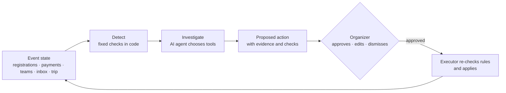
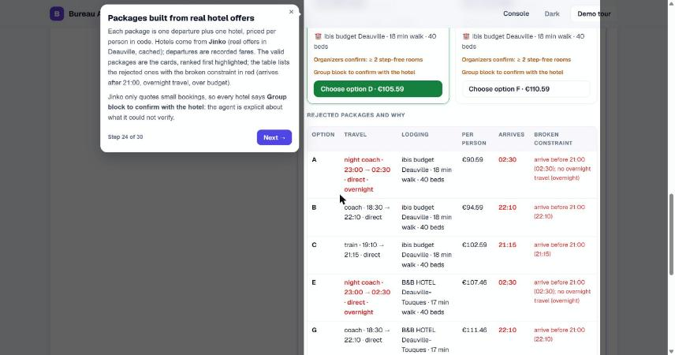

# Bureau Agent

**An operations agent for volunteer-run associations.** It finds what needs attention in an event, investigates it with tools, and proposes one action with its evidence. **Nothing is sent, changed or booked until an organizer approves it.**

> LLM for ambiguity · Code for invariants · Humans for accountability

**▶ Try it online:** TODO (link to the Hugging Face Space, T20) · **🎬 Demo video (2 min):** TODO · **🧭 Guided demo:** open the app and click **Start the guided demo**

Built during the X-IA Hackathon #1 "Rise of Agents X" (25–27 September 2026). All code in this repository was written during the hackathon.


---

## The problem

Student and volunteer associations run real events (hackathons, integration weekends, galas) with a board of volunteers who study or work full time. Around every event they juggle:
- registrations and payments that do not match ("I already paid from my personal email");
- team and room rules;
- trips with several constraints (budget, arrival time, accessibility);
- dozens of repetitive messages in French and English.

The work is not hard. It is **fragmented, repetitive, and easy to get wrong**, and a mistake (a wrong payment link, a missing reply, a team over the limit) lands on a participant.

## What Bureau Agent does

One loop handles every kind of event:



1. **Detect.** Deterministic checks read the event and list what needs attention, blocking first: unmatched payments, unpaid fees, a person in two teams, a team over capacity, unanswered messages, a trip without a plan. 31 issues are found in the sample hackathon.
2. **Investigate.** An AI agent (OpenAI `gpt-4.1`, tool calling) picks its own tools: look up a participant, read payments, score an identity match, search the rules, check teams. It proposes **one** action: link a payment, send a reply, move a member, or ask the organizers. Every tool call is recorded and shown.
3. **Decide.** The organizer sees the proposal first, with the agent's question, the evidence and an editable draft reply. Approving is what changes data or "sends" the reply (to a simulated outbox), and it is logged.

The same loop plans trips. The organizer's request ("40 students, leave after class, max €… per person, arrive before 21:00, no overnight travel, two step-free rooms") becomes structured constraints. The planner **asks before searching** when something is ambiguous. It builds packages from **real hotel offers (Jinko)** and checks every package in code. It **never relaxes a constraint by itself**: when nothing fits, it says which single change would unlock an option.

## Why it is safe to use

| Risk | What prevents it |
|---|---|
| The model links a payment to the wrong person | The identity score is enforced **in code** at two layers (proposal and approval): below 0.70 is refused. A live `gpt-4o-mini` run did propose such a link; it is now impossible. |
| The model invents a rule | Answers must cite a rule section; when the rules are silent, it escalates to the organizers ("silence is not permission"). |
| A personal-data or refund request | Escalated, never answered by the agent. |
| A team over the size limit, a person in two teams | Group invariants are re-checked by the executor on approval. |
| A trip that breaks a constraint | Hard constraints are checked in code; soft preferences only rank valid options; accessibility is marked "organizers confirm". |
| Anything with consequences | Every action requires approval, drafted replies carry "Drafted with AI assistance, approved by the organizers.", and approvals are logged. |

## Results

Offline evaluation on **50 labeled messages** (the 25 sample messages plus 25 paraphrases), same code, one run per model ([details](eval/README.md)):

| Metric | `gpt-4.1` (default) | `gpt-4o-mini` |
|---|---|---|
| Correct action type | **90%** (45/50) | 76% (38/50) |
| Rule citation | **96.7%** | 90.0% |
| Asks the organizers at the right time | **84%** | 66% |
| Unnecessary questions to organizers | **6** | 15 |
| Invariant violations | **0** | 1 |

Constraint extraction on 8 labeled trip requests: hard constraints 8/8, clarification presence 8/8.

**171 automated tests** (no API calls: a scripted fake model) run on every push.

Real-user feedback: TODO (T18).

## Try it

### Online
TODO: the Hugging Face Space link (T20). Open it and click **Start the guided demo**, a 5-minute, 30-step tour that highlights each button.

### Locally
Requires Python 3.11+ and an OpenAI API key for the live agent. Everything else works without a key.

**macOS / Linux**
```bash
git clone https://github.com/TieuDaoChanNhan/bureau-agent.git && cd bureau-agent
python3 -m venv .venv && source .venv/bin/activate
pip install -r requirements.txt
cp .env.example .env            # then put your key in OPENAI_API_KEY=...
uvicorn api.main:app --reload   # open http://127.0.0.1:8000
```

**Windows (PowerShell)**
```powershell
git clone https://github.com/TieuDaoChanNhan/bureau-agent.git; cd bureau-agent
py -3.11 -m venv .venv; .\.venv\Scripts\Activate.ps1
python -m pip install -r requirements.txt
Copy-Item .env.example .env     # then put your key in OPENAI_API_KEY=...
$env:PYTHONIOENCODING="utf-8"; python -m uvicorn api.main:app --reload
```

Then open http://127.0.0.1:8000 and click **Start the guided demo**. **Reset demo** (click twice) restores the sample data. Write the key without quotes: `OPENAI_API_KEY=sk-...`.

**Tests and evaluation**
```bash
python -m unittest discover -s tests -t .     # 171 tests, no API key needed
python -m eval.run_eval                       # 50-case evaluation (needs a key)
python -m bureau plan wei --recorded-constraints   # trip planner offline
```

## Features at a glance

| | |
|---|---|
| **Guided demo** | 30 steps, each highlighting one element, with explanations; it moves on by itself after each action |
| **Agent steps** | Every tool the model chose, with arguments and results, replayed step by step after a run |
| **Proposal first** | Action, the agent's question, what will change, and the editable draft reply, then the evidence |
| **Live messages** | Type any message (English or French) and watch the agent handle it |
| **Batch run** | Run the agent on every open issue with progress and Stop |
| **Trip planner** | Asks before searching, real hotel offers, packages checked in code, a what-if budget, and a diagnosis without relaxing constraints |
| **Dependencies** | Choosing a travel plan unlocks the issues waiting for it (reminders, rooms, meeting time) |




## Architecture

| Layer | Folder | Role |
|---|---|---|
| Core | [`bureau/core/`](bureau/core/README.md) | Data model, issue detection (fixed checks), storage, the **executor**: the only code that changes data, after approval |
| Tools | [`bureau/tools/`](bureau/tools/README.md) | Deterministic functions the agent calls: rules search, eligibility, identity scoring, group checks |
| Agent | [`bureau/agent/`](bureau/agent/README.md) | One tool-calling agent: prompt, tool schemas, a loop that validates proposals and records every step |
| Planner | [`bureau/planner/`](bureau/planner/README.md) | LLM constraint extraction → Jinko hotels × transport → packages in code → hard-constraint gate → ranking → LLM explanation |
| API | [`api/`](api/README.md) | FastAPI routes used by the web console |
| Web | [`web/`](web/README.md) | Static HTML/JS console and guided tour (no build step) |
| Evaluation | [`eval/`](eval/README.md) | Labeled cases, runner, recorded model comparison |

Design choices: **one agent, not several** (the loop is the product); invariants in code, not in the prompt; the agent only proposes; timezone-aware dates and money in integer cents.

## Sponsor tools

| Tool | How we used it |
|---|---|
| **OpenAI** | `gpt-4.1` with tool calling for the agent; strict structured output for trip constraints; short trade-off explanations. Chosen after measuring `gpt-4o-mini` (table above). |
| **Jinko** | Live hotel search, cached for replay (no network in tests and in the demo). Findings: our key works on the production host; ground search returned 404 for it; **group blocks (10×4 or 20×2 rooms) return no availability**, and rates allow "5 passengers and under". So a room is priced and scaled, and every package says "group block to confirm with the hotel". |
| **Pipelex** | Tried first for constraint extraction (typed `PipeLLM`, it worked on our case). We kept OpenAI structured output because it covered this one call with less setup ([why](bureau/planner/README.md)). |

## What is real and what is simulated

| Component | In this build |
|---|---|
| Issue detection, rule checks, identity scoring, constraint gate, executor | Real (Python), tested |
| Agent investigation, constraint extraction, explanations | Real (OpenAI `gpt-4.1`) |
| Hotel offers | Real Jinko responses, cached |
| Transport options | Recorded illustrative fares (Jinko ground search unavailable for our key) |
| Registrations, payments, messages | Fictional sample data with planted inconsistencies; no real personal data |
| Sending, booking, paying | Not performed: approved replies go to a simulated outbox, and organizers book themselves |

## Limitations

- Sample data only; not yet connected to a real inbox, Discord, Luma or HelloAsso export.
- The local JSON store assumes one writer at a time. The deployed demo isolates each browser (T20).
- Trip transport uses recorded fares, and group hotel blocks must be confirmed with the venue.
- The agent's steps are shown after a run (replayed), not streamed live.

## Team

TODO: full names (X-IA Hackathon #1). GitHub: [@TieuDaoChanNhan](https://github.com/TieuDaoChanNhan), [@0x2ee08](https://github.com/0x2ee08), [@pectpait](https://github.com/pectpait), [@hoanxuanbach](https://github.com/hoanxuanbach).

How we worked: issues, pull requests and reviews ([CONTRIBUTING.md](CONTRIBUTING.md), [TASKS.md](TASKS.md)). Internal planning documents under `docs/` are in Vietnamese.

## License

TODO (T19): MIT unless the team decides otherwise.
